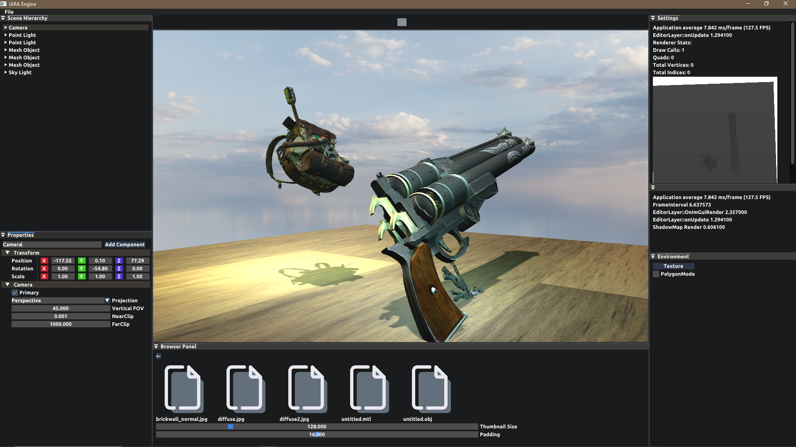

VULKAN SDK required  
  
ALT + MBL             -- to rotate the camera inside the editor  
ALT + MouseWheelHold  -- to move the camera inside the editor  
  
SHIFT + MBL           -- to select entities  
CTRL + W              -- activate translation gizmo of the currently selected entity  
CTRL + E              -- activate rotation gizmo of the currently selected entity  
CTRL + R              -- activate scale gizmo of the currently selected entity  
CTRL + Q              -- no gizmo  

## ✨ Features

- 🧱 **Entity-Component-System (ECS)** architecture using `entt`
- 🎮 **Scene Editor** with ImGui-based interface
- 🖱️ **Mouse Picking** support
- 🗂️ **Drag-and-Drop Scene Loading**
- 💾 **YAML Serialization** for scene saving/loading
- 🌐 **OpenGL Renderer** with support for SPIR-V shader compilation (Blinn-Phong, shadows)
- 🧭 **Editor Camera** for scene navigation

---

## 🧰 Technologies Used

- C++17
- OpenGL 4.x
- GLAD – OpenGL function loader
- GLFW – Window and input handling
- ImGui – Immediate Mode GUI
- EnTT – Entity Component System
- Assimp – Asset importing (e.g., 3D models)
- YAML-CPP – YAML parser for scene serialization
