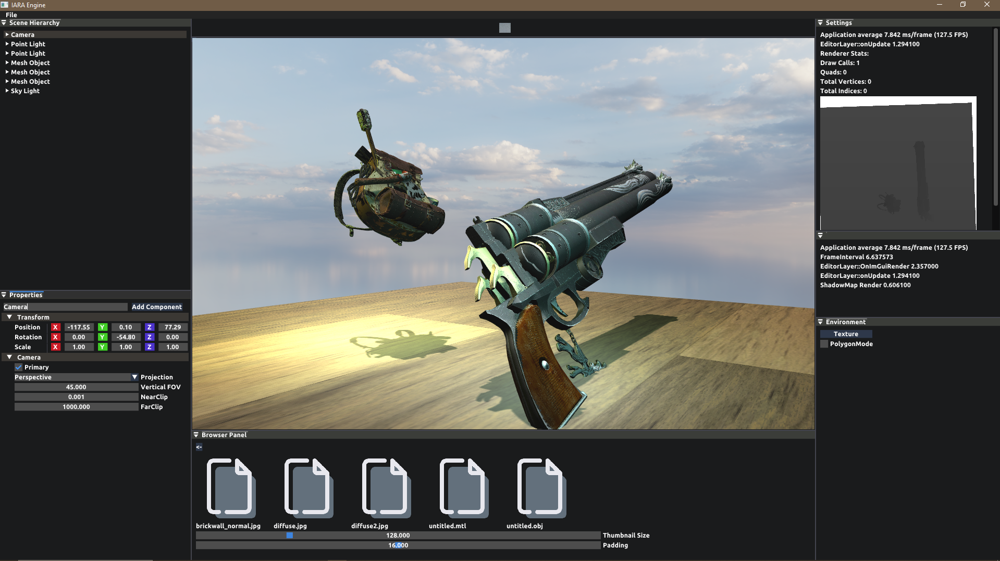
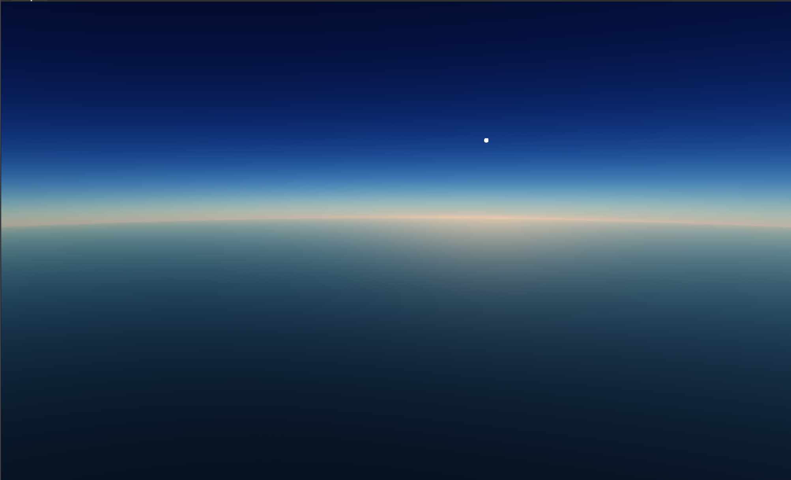
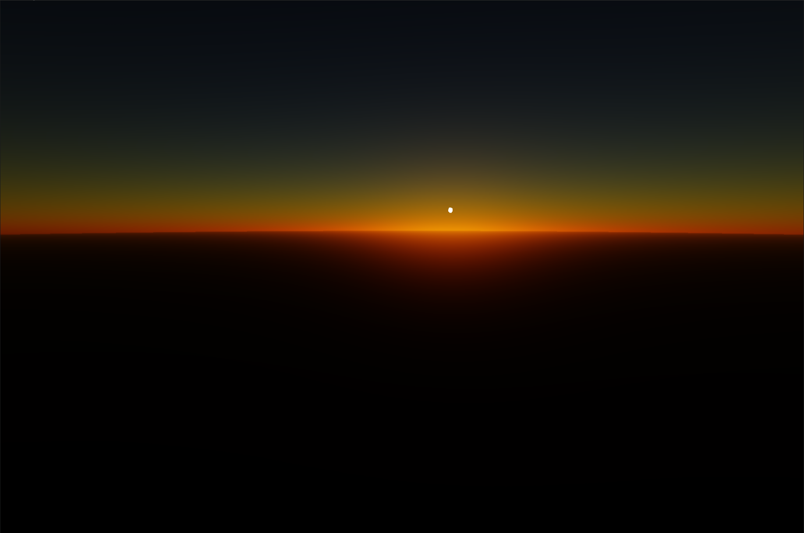
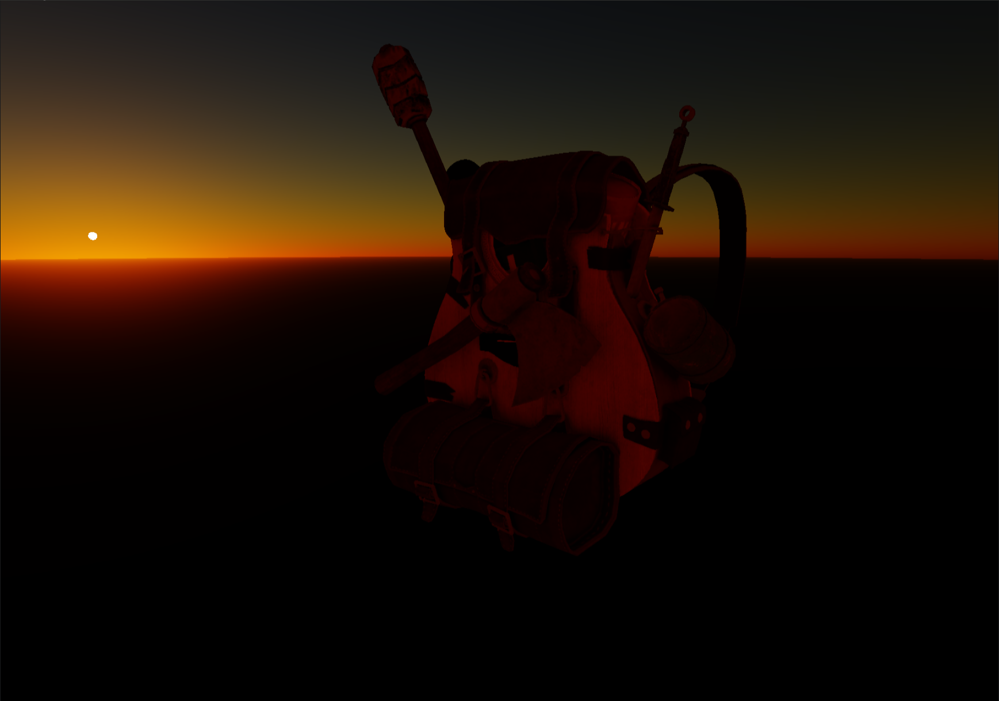
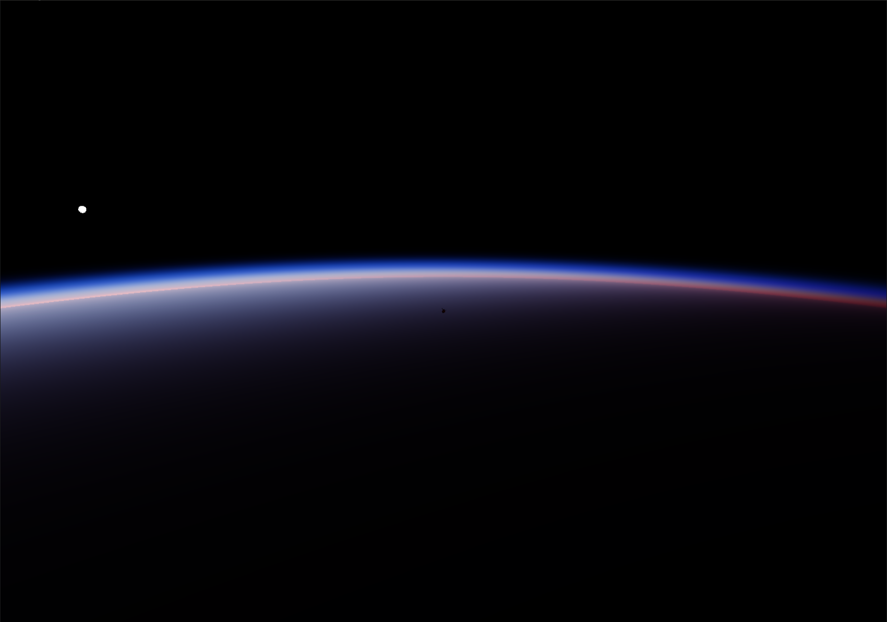

## Build

- General Project is build by running generate.bat file in the root dir
- Assimp must be built separately inside it's own directory using CMake:
- cmake -S . -B build -G "Visual Studio 17 2022" -A x64 -DBUILD_SHARED_LIBS=OFF -DASSIMP_BUILD_ZLIB=ON -DASSIMP_BUILD_ASSIMP_TOOLS=OFF -DASSIMP_BUILD_TESTS=OFF
- cmake --build build --config Release    and     cmake --build build --config Release

# Graphics & Game Engine

A modern, high-performance graphics and game engine written in **C++**, designed with a modular architecture and a strong focus on real-time rendering techniques.  
The engine includes an integrated editor for interactive scene creation and inspection, as well as a flexible Entity-Component-System (ECS) core.

---

## Acknowledgements

- Eric Bruneton, *Precomputed Atmospheric Scattering*,  
  originally published at Google Research.  
  This engine contains an independent implementation inspired by the reference algorithm.

## Requirements

- **Vulkan SDK** (required for shader compilation and tooling)
- C++17 compatible compiler
- Windows (primary development platform)

## Screenshots

---

## Engine Features

### Rendering
- Real-time **3D mesh rendering**
- Physically-motivated lighting system (multiple light types)
- **Screen Space Ambient Occlusion (SSAO)**
- **Skybox rendering**
- Shadow mapping
- Blinn-Phong shading model
- SPIR-V shader compilation pipeline

### Atmospheric Rendering
- **Precomputed Atmospheric Scattering** based on  
  *Eric Bruneton’s reference implementation*
- Physically-based sky and aerial perspective
- Multi-order scattering support

### Editor & Tooling
- ImGui-based scene editor
- Editor camera for intuitive navigation
- Mouse picking for entity selection
- Transform gizmos (translate, rotate, scale)
- Drag-and-drop scene loading

### Serialization
- Scene save/load using **YAML**
- Stable entity identifiers across sessions

---

## Technologies Used

- **C++17**
- **OpenGL 4.x**
- **Vulkan SDK** (shader compilation and tooling)
- GLAD — OpenGL function loader
- GLFW — Windowing and input
- ImGui — Editor user interface
- EnTT — Entity-Component-System framework
- Assimp — Asset import (3D models)
- YAML-CPP — Scene serialization

---

## Project Structure (High Level)

